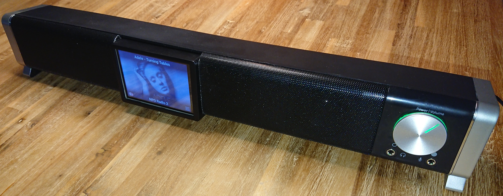
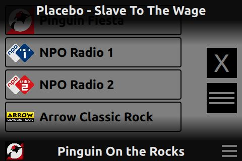

# PiRadio
Internet Radio, intended for the Raspberry Pi

 

Introduction
------------

At the end of 2020, I found an somewhat old Raspberry Pi 2 B and an Edimax N150 USB WiFi antenna in my attic.

I always wanted a kind of internet-radio in my garage. So, I decided to try combine the two.

This is my travels to get the Pi to become my internet-radio with a list of my favourite channels, artist/title acquiring and cover art support.

For hardware and assembly, please see [hardware](docs/hardware.md) chapter.  
For setting up the Raspberry Pi, please see the [setup](docs/setup.md) chapter.

Application
-----------

I decided to go with C++/QML combo as my radio application because I wanted to learn a bit more about QML and its connection to C++.

 
Normal operation with artist, title and cover art. 
 
 
 
Part of the list of radio channels for selection. 
 
 
I used [this guide](https://www.raspberrypi-spy.co.uk/2014/05/how-to-autostart-apps-in-rasbian-lxde-desktop/) to start PiRadio automatically. 
 
The 'autostart' mentioned in the previous guide was used to switch off screen blanking by adding:  
@xset s noblank  
@xset s off  
@xset -dpms  
