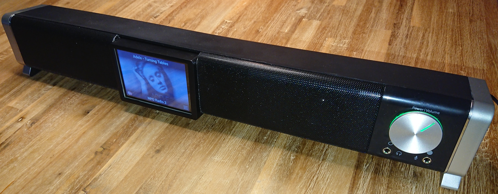

# Hardware

This, I had lying around:

* [Raspberry Pi 2 B](https://www.raspberrypi.org/)
* [Edimax N150 USB WiFi antenna](https://www.edimax.com/edimax/merchandise/merchandise_detail/data/edimax/in/wireless_adapters_n150/ew-7711uan_v2/).
* 32 GB microSD card.

After I had some PiRadio prototype working, I bought the following:

* [Trust Asto, PC Soundbar](https://www.trust.com/en/product/21046-asto-soundbar-for-pc-tv) (not affiliated).
* [3.5 Inch touchscreen](https://www.tinytronics.nl/shop/nl/raspberry-pi/accessoires/3.5-inch-tft-display-320*480-pixels-met-touchscreen-raspberry-pi-compatible) (dutch, not affiliated).
* [Case](https://www.tinytronics.nl/shop/nl/raspberry-pi/behuizingen/raspberry-pi-2-3(b)-behuizing-zwart-optie-voor-3.5-inch-display) (dutch, not affiliated).
* Micro-USB power supply (5.1V, 2.5A, 12.75W).

How To Mess Up A Soundbar
------------------------

The intention is to create a single internet radio by shoving the Pi and its screen into the soundbar.

The sound of the soundbar is good enough for my purpose (especially considering the price). However, I'll be cutting parts from it and gluing stuff into it. This will likely have a detrimental influence on the sound. But we'll see.

 
The hardware, with an opened up soundbar. 
 
 
 
 
Cutting up the front. 
 
 
 
 
 
Cutting up the back with Pi Case placement. 
 
 
 
WiFi Antenna placement. 
 
 
 
Gluing Pi Case backpanel and WiFi Antenna. 
 
 
 
Because there's no space under the soundbar, the power and audio connections are soldered directly onto the Pi. 
 
 
 
 
 
Putting it together. 
 
 
